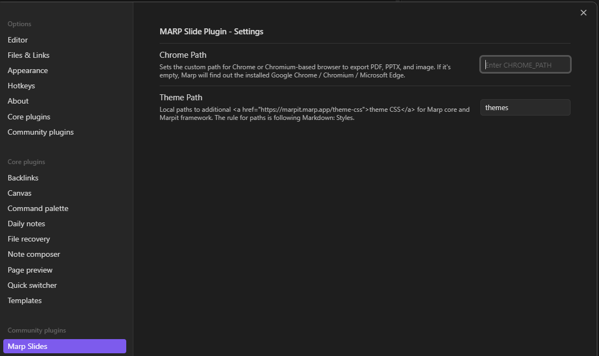
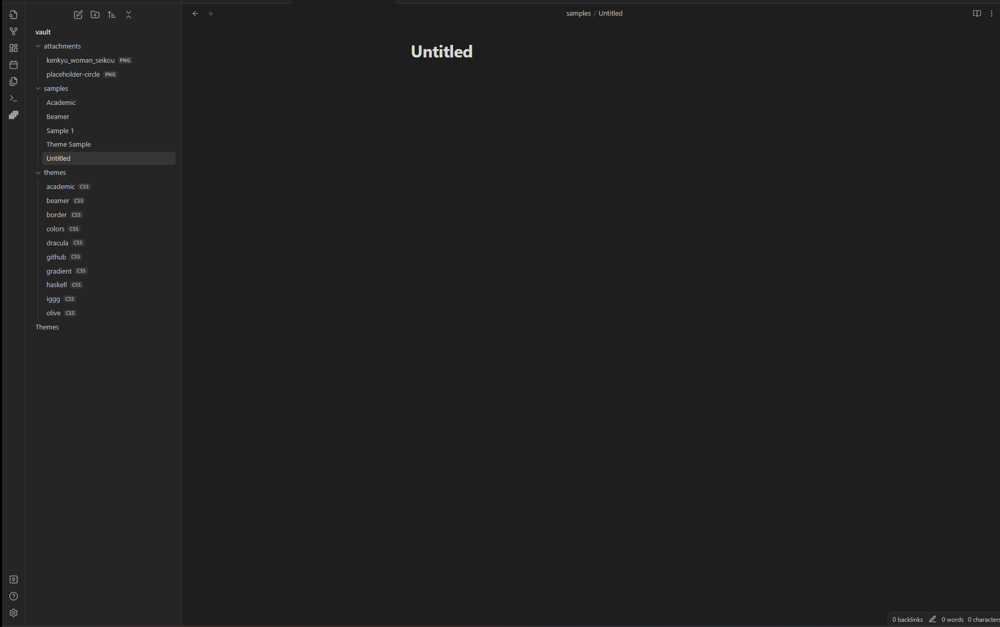

# Getting Started

## Setup Vault

Obsidian is a powerful note-taking app that allows users to create and organize their notes and ideas in a highly customizable and intuitive interface. Setting up Obsidian for optimal use requires a few key steps to ensure that you can get the most out of the app's features and capabilities.

The first step in setting up Obsidian is to create a vault, which is essentially a container for all of your notes and files. This can be done by simply creating a new folder on your computer and selecting it as your vault location within the app's settings. Once your vault is set up, you can start creating notes and organizing them into folders and subfolders as needed.

Next, it's important to customize Obsidian's settings to fit your workflow and preferences. This includes adjusting things like the default font and theme, enabling or disabling various plugins, and configuring hotkeys and other shortcuts for quick access to frequently used features.

### Settings

#### Chrome Path

Sets the custom path for Chrome or Chromium-based browser to export PDF, PPTX, and image. If it\'s empty, Marp will find out the installed Google Chrome / Chromium / Microsoft Edge.

#### Theme Path

Local paths to additional [theme CSS](https://marpit.marp.app/theme-css) for Marp core and Marpit framework. The rule for paths is following Markdown: Styles.

#### Enable HTML

Enable all HTML elements in Marp Markdown. Please Attention when you enable!!!

#### Math Typesettings

Controls math syntax and the default library for rendering math in Marp Core. A using library can override by math global directive in Markdown.

## Marp Syntax

Here are some of the key elements of Marp's syntax, along with references to their official documentation:

- Markdown: Marp uses standard Markdown syntax for formatting text, including headings, lists, links, images, and more. For a comprehensive guide to Markdown syntax, see the official documentation: https://www.markdownguide.org/basic-syntax/

- Slide separators: To create a new slide in Marp, you simply insert three hyphens (---) between two lines of text. You can also use three equal signs (===) to create a separator between slides. For more information on slide separators, see: https://marpit.marp.app/markdown#slide-separators

- Code blocks: Marp supports syntax highlighting for code blocks, which can be useful for technical presentations. To create a code block, simply indent the text by four spaces, or use triple backticks (`) to enclose the code. For more information on code blocks, see: https://marpit.marp.app/markdown#code-blocks

- Themes: Marp comes with a range of built-in themes for styling your presentations. You can also create your own custom themes using CSS. To apply a theme to your presentation, simply add a theme directive to the first line of your Markdown file. For more information on themes, see: https://marpit.marp.app/theme-css

- Speaker notes: Marp allows you to add speaker notes to your presentation, which are visible only to the presenter. To create speaker notes, simply add text inside the square brackets ([ ]) following a slide separator. For more information on speaker notes, see: https://marpit.marp.app/markdown#speaker-notes

These are just a few examples of Marp's syntax. For more detailed information and examples, you can refer to Marp's official documentation: https://marpit.marp.app/

## First Deck

When creating a presentation, it's important to plan out your content and structure in advance to ensure that your message is clear and engaging. One way to do this is to break your presentation into a series of slides that each convey a specific point or idea.

Here are some tips for creating effective slides in Marp:

1. First, start by writing your first slide. This slide should introduce your topic and grab your audience's attention. Keep it concise and to the point, and consider using a bold or eye-catching font to make it stand out.

2. Next, preview your slides to get a sense of the overall flow and structure of your presentation. Marp allows you to view your slides in real-time as you write, so you can see how each slide looks as you go.

3. For your second slide, consider adding a picture to help illustrate your point. Marp allows you to easily add images to your slides, and you can even set them as the background for your slide for added impact.

4. When designing your slides, don't forget to add a footer that includes your name, the date, and the title of your presentation. This helps to give your presentation a professional look and feel, and also makes it easier for your audience to keep track of where they are in the presentation.

5. Finally, consider changing the theme of your presentation to give it a unique and polished look. Marp comes with a range of built-in themes to choose from, or you can create your own custom theme using CSS for a truly personalized touch.

By following these tips and using Marp's simple and intuitive syntax, you can create engaging and effective presentations that captivate your audience and convey your message with clarity and impact.