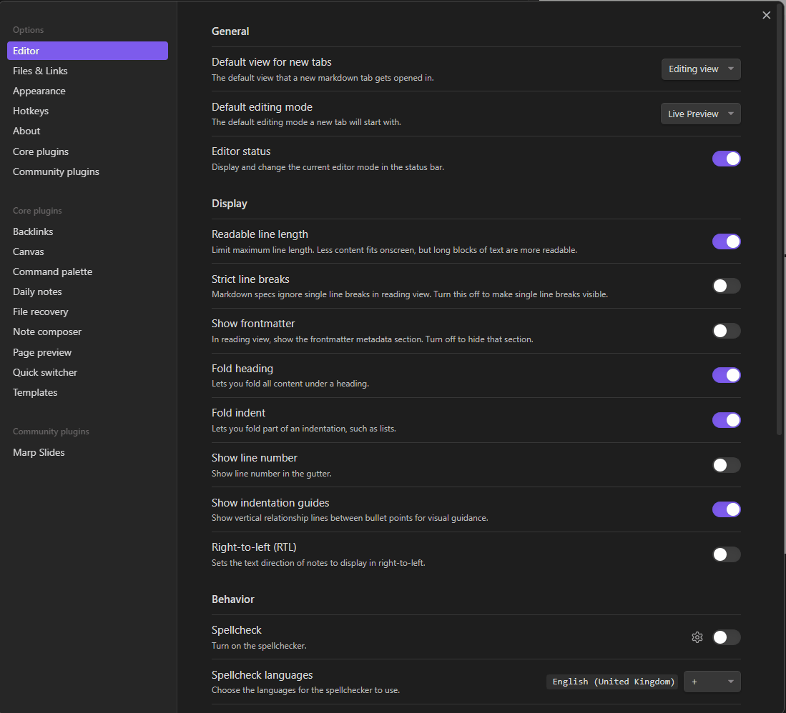

# Setup Vault

Obsidian is a powerful note-taking app that allows users to create and organize their notes and ideas in a highly customizable and intuitive interface. Setting up Obsidian for optimal use requires a few key steps to ensure that you can get the most out of the app's features and capabilities.

The first step in setting up Obsidian is to create a vault, which is essentially a container for all of your notes and files. This can be done by simply creating a new folder on your computer and selecting it as your vault location within the app's settings. Once your vault is set up, you can start creating notes and organizing them into folders and subfolders as needed.

Next, it's important to customize Obsidian's settings to fit your workflow and preferences. This includes adjusting things like the default font and theme, enabling or disabling various plugins, and configuring hotkeys and other shortcuts for quick access to frequently used features.

- Relative path to files
- Not use Wikilinks
- Detect all file extension