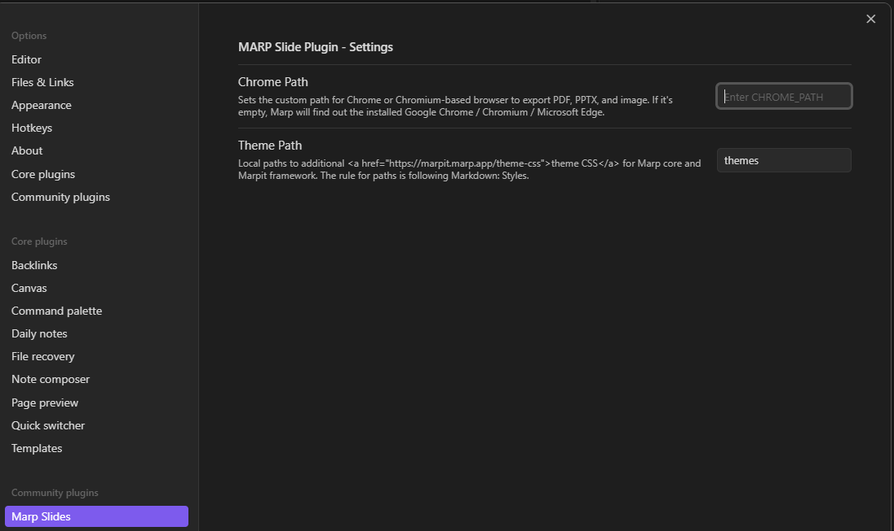

# Configuration

## Chrome Path

Sets the custom path for Chrome or Chromium-based browser to export PDF, PPTX, and image. If it\'s empty, Marp will find out the installed Google Chrome / Chromium / Microsoft Edge.

## Theme Path

Local paths to additional [theme CSS](https://marpit.marp.app/theme-css) for Marp core and Marpit framework. The rule for paths is following Markdown: Styles.

## Export Path

Specifies the user-defined path for exporting PDF, PPTX, and images. If left empty, Marp will export them in the same folder as the note. It's important to note that the export path has no impact on HTML exports.

## Enable HTML

Enable all HTML elements in Marp Markdown. Please Attention when you enable!!!

## Math Typesettings

Controls math syntax and the default library for rendering math in Marp Core. A using library can override by math global directive in Markdown.

## HTML Export

**This is an EXPERIMENTAL feature**

Controls HTML library for eporting HTML File in Marp Cli. bespoke.js is experimental

## Sync Preview

**This is an EXPERIMENTAL feature**

Sync the slide preview with the editor cursor

## Markdown It Plugins

**This is an EXPERIMENTAL feature**

Enable the [Markdown It Plugins](30.Markdown-it-Plugins.md) (Mark, Containers, Kroki)