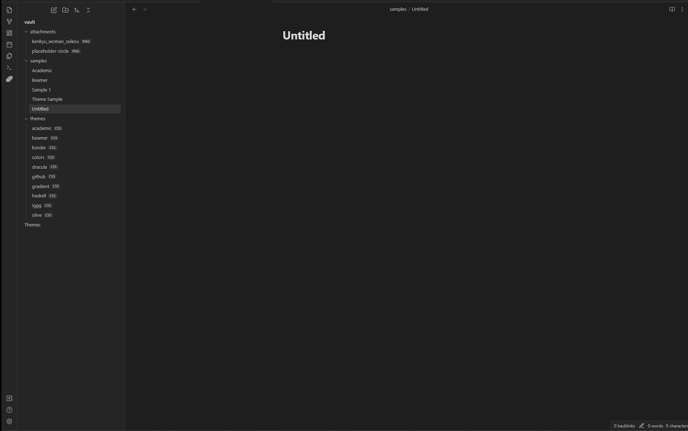

# First Deck

When creating a presentation, it's important to plan out your content and structure in advance to ensure that your message is clear and engaging. One way to do this is to break your presentation into a series of slides that each convey a specific point or idea.

Here are some tips for creating effective slides in Marp:

1. First, start by writing your first slide. This slide should introduce your topic and grab your audience's attention. Keep it concise and to the point, and consider using a bold or eye-catching font to make it stand out.

2. Next, preview your slides to get a sense of the overall flow and structure of your presentation. Marp allows you to view your slides in real-time as you write, so you can see how each slide looks as you go.

3. For your second slide, consider adding a picture to help illustrate your point. Marp allows you to easily add images to your slides, and you can even set them as the background for your slide for added impact.

4. When designing your slides, don't forget to add a footer that includes your name, the date, and the title of your presentation. This helps to give your presentation a professional look and feel, and also makes it easier for your audience to keep track of where they are in the presentation.

5. Finally, consider changing the theme of your presentation to give it a unique and polished look. Marp comes with a range of built-in themes to choose from, or you can create your own custom theme using CSS for a truly personalized touch.

By following these tips and using Marp's simple and intuitive syntax, you can create engaging and effective presentations that captivate your audience and convey your message with clarity and impact.