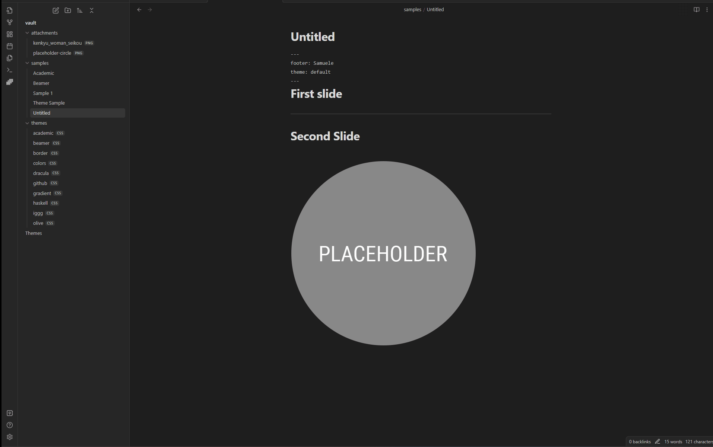
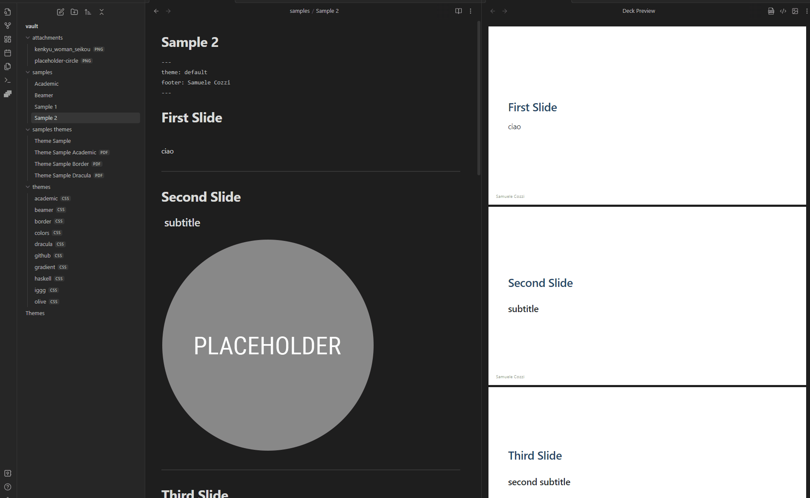

# Preview Slides

Marp for Obsidian lets you preview your Marp Markdown in real time, allowing you to instantly view changes as you make them! With this feature, you can quickly refine and perfect your Markdown documents.

The preview of the content of active Markdow editor, use the ribbon icon or execute command from the Command Palette (<kbd>Ctrl/Cmd+P</kbd> + 'Slide Preview')

## Auto-scaling features

- **Fitting header**: Get bigger heading that fit onto the slide by # `<!--fit-->`.
- Auto-shrink the **code block**
- Auto-shrink **KaTeX block**

[reference](https://github.com/marp-team/marp-core#auto-scaling-features)