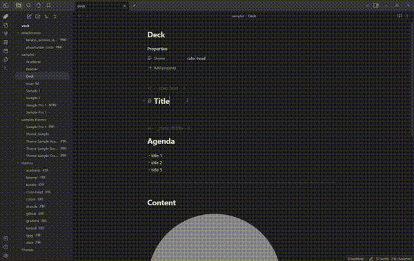

# Export slide deck (html, pdf, pptx, img)

We have integrated [Marp CLI](https://github.com/marp-team/marp-cli/) to export your deck into several formats.

To export the content of active Markdown editor execute command from the Command Palette (<kbd>Ctrl/Cmd+P</kbd>).

## Supported file types

- **HTML** export
- **PDF** with or without annotation
- **PPTX** PowerPoint document
- **PNG** One file for every slide

> ⚠️ Export except HTML requires to install any one of [Google Chrome](https://www.google.com/chrome/), [Chromium](https://www.chromium.org/), or [Microsoft Edge](https://www.microsoft.com/edge). You may also specify the custom path for Chrome / Chromium-based browser by preference `CHEROME_PATH`.