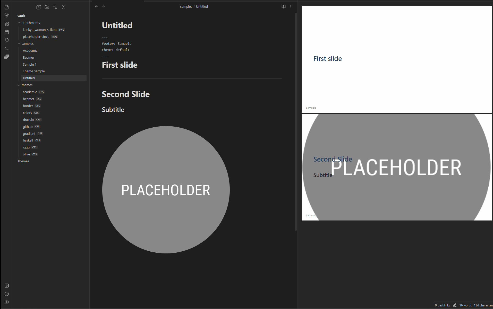

# Use custom theme CSS

You can register and use [custom theme CSS for Marpit](https://marpit.marp.app/theme-css) / [Marp Core](https://github.com/marp-team/marp-core/tree/main/themes#readme) by setting `ThemePath`, that includes relative paths to local files in the current vault.
The registered theme can use by specifying theme name in [`theme` global directive](https://marpit.marp.app/directives?id=theme).



Theme.css:

```css
/* @theme your-theme */

@import 'default';

section {
  background: #fc9;
}
```

Slides.md:

```markdown
---
theme: your-theme
---

# Use your own theme

---

# Second Slide
```

Markdown preview will reload updated theme CSS automatically when you edited the registered local CSS file.

---
