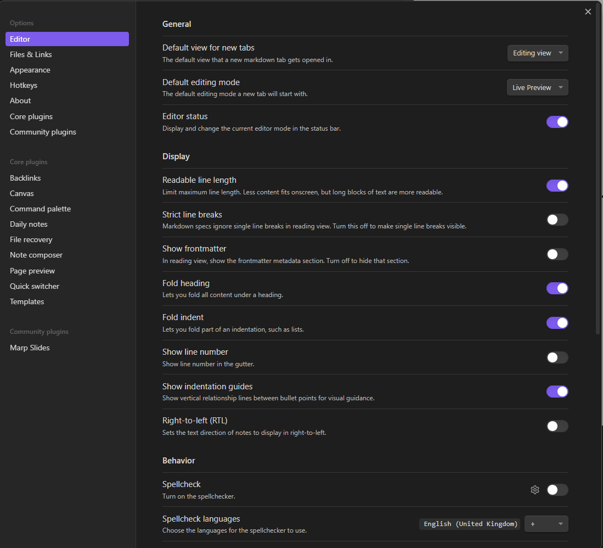
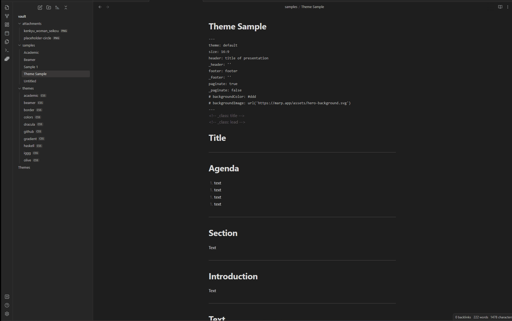

# Examples

## Setup Vault

- clone and open
- install marp community plugin
- configure obsidian
- configure theme

## Example Vault

We have created a dedicated Obsidian vault for testing the plugin and Marp presentations. It is a great way to explore the full potential of these tool without impacting your main vault or risking any data loss or corruption. By using a separate vault for testing, you can experiment freely and make changes without worrying about affecting your existing notes and files.

To set up a lab Obsidian vault, you can clone the [plugin repository](https://github.com/samuele-cozzi/obsidian-marp-slides) and open the vault folder with obsidian.

One area where the lab vault can be especially useful is in testing Marp presentations. Marp is an open-source tool that allows users to create professional-looking presentations using simple Markdown syntax. By building and testing Marp presentations within your lab Obsidian vault, you can experiment with different formatting options and see how your presentations look and feel in a safe and isolated environment.
