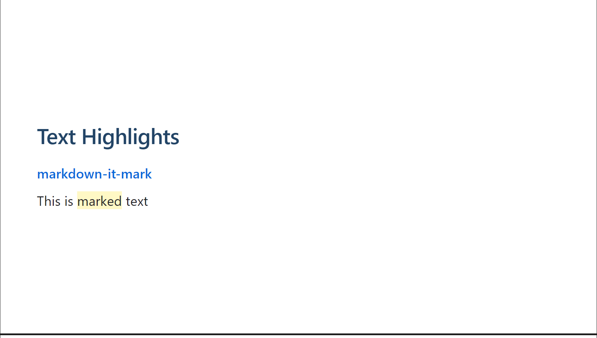

Markup uses the same conditions as CommonMark [emphasis](http://spec.commonmark.org/0.15/#emphasis-and-strong-emphasis).

`==marked==` => `<mark>inserted</mark>`

## Sample

```markdown
---
# Text Highlights

**[markdown-it-mark](https://github.com/markdown-it/markdown-it-mark)**

This is ==marked== text
---
```



## References

- [markdown-it-mark](https://github.com/markdown-it/markdown-it-mark)
