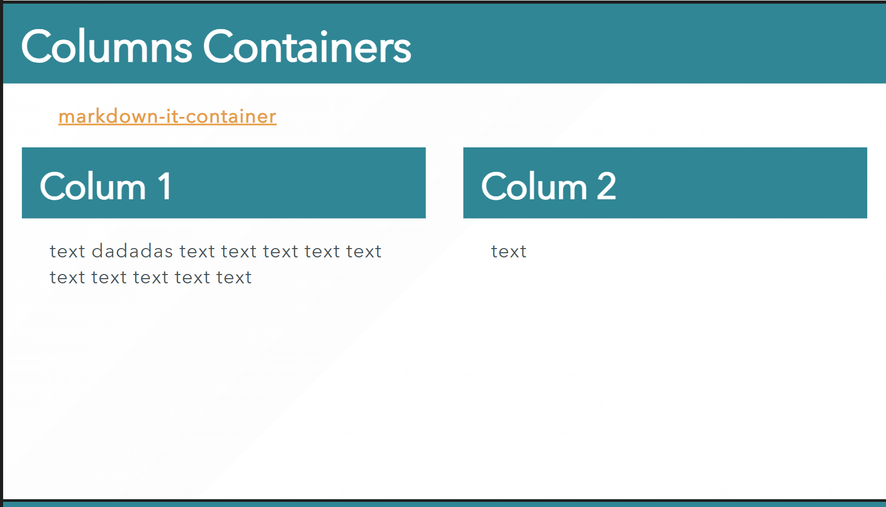

# Markdown-It Container

With this plugin you can create block containers like:

```markdown
::: container
*here be dragons*
:::
```

.... and specify how they should be rendered. If no renderer defined, `<div>` with
container name class will be created:

```html
<div class="container">
<em>here be dragons</em>
</div>
```

## Sample

```markdown
---

<!-- _class: box-flex -->
# Columns Containers

**[markdown-it-container](https://github.com/markdown-it/markdown-it-container)**

::: container
## Colum 1

text dadadas text text text text text text text text text text 

:::

::: container
## Colum 2

text

:::

---
```




## References

- [markdown-it-container](https://github.com/markdown-it/markdown-it-container)