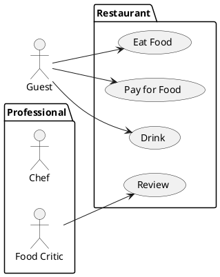
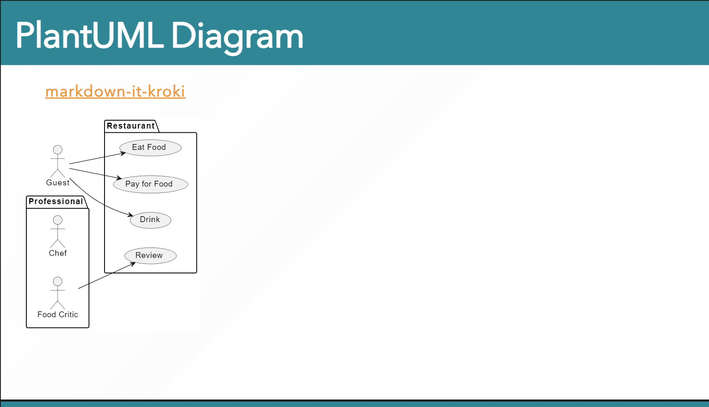

# markdown-it-kroki

> This library was designed to embed [Kroki.io](https://kroki.io/) diagram into [Marp](https://marp.app/) slide decks!!

This library is a plugin for markdown-it to embed figure created by textual syntax.
To use this package, you can embed **Software Diagram** (like UML) written by **code** in Marp slide decks.

## Sample

If you want to write diagrams, you can use various syntaxes (such as [PlantUML](https://plantuml.com/) or [Mermaid](https://mermaid-js.github.io/mermaid/#/)) within fenced code blocks.

> [!NOTE]  
> This package depends on [Kroki.io](https://kroki.io).   
> If you want to know which **diagram languages are supported**,
> please check the official website at [https://kroki.io/](https://kroki.io/).

## References

- [markdown-it-kroki](https://github.com/kazumatu981/markdown-it-kroki)